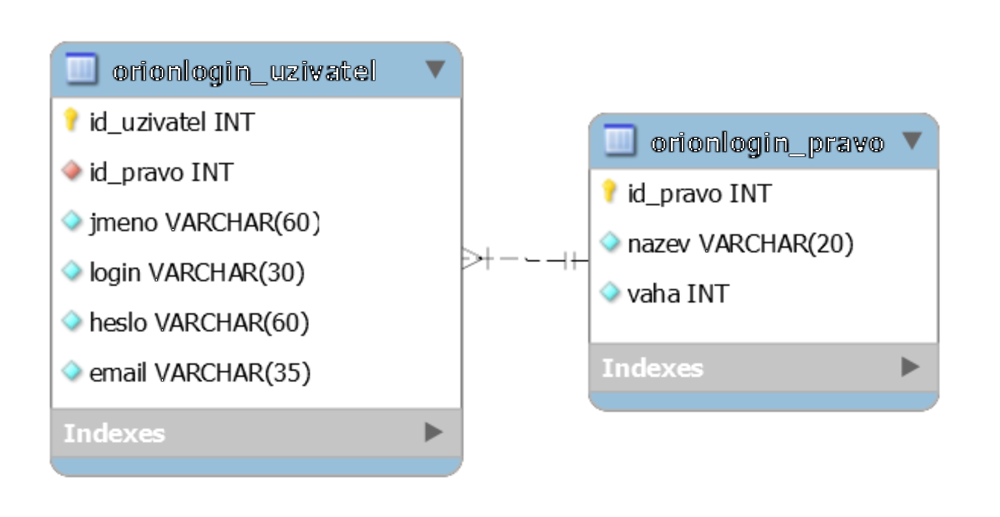

# 6. cvičení KIV/WEB - PHP a práce s databází (PDO).

* Projděte si prezentaci k tomuto cvičení.

## 0. úkol - Zprovoznění webové aplikace 

* Prohlédněte si a zprovozněte dodané soubory - požadavkem je, aby vám fungovaly odkazy v menu: 
  * Vstupním bodem do aplikace je *index.php*, který načítá jednotlivé stránky webu.
  * Soubor s nastavením *settings.inc.php* obsahuje konfiguraci připojení k databázi 
  a konfiguraci souborů jednotlivých stránek webu.

## 1. úkol - Návrh schému databáze a import databáze

* ERA model databáze:

  
* Protože tento úkol se přímo netýká PHP, tak ho lze vyřešit více způsoby:
  * Kompletní návrh databáze, tj. návrh celého schématu databáze např. v MySQL Workbench. (nejnáročnější)
  * Úprava souboru pro MySQL Workbench.
  * Úprava pouze souboru pro import schématu databáze. (nejlehčí)

* Kompletní návrh databáze:
  * V nástroji MySQL Workbench navrhněte zjednodušené schéma databáze:
    * Dvě tabulky (uživatelé a práva) s relací 1:N. 
    * Atributy tabulek lze využít nastavit dle prezentace či dle přiloženého obrázku.
    * **Pokud pracujete na *students.kiv.zcu.cz***, tak názvy tabulek musí mít předponu s vaším orionloginem (např.: nyklm_uzivatel a nyklm_pravo).
  * Naplňte databázi základními daty:
    * V tabulce s právy uživatelů vytvořte 4 práva, např.: SuperAdmin, Admin, Recenzent a Autor.
    * V tabulce s jednotlivými uživateli vytvořte alespoň jednoho uživatele, který bude SuperAdmin.
  * Exportujte SQL skript pro instalaci databáze. Při exportu zvolte následující volby:
    * *Generate DROP Statements* ... - smazání v databázi dříve vytvořených tabulek stejných názvů.
    * *Omit SCHEMA* ... - vynechat z názvu tabulek název databáze.
    * *Generate INSERT* ... - exportovat i defaultní data tabulek, tj. práva a uživatele.

* Úprava souboru pro MySQL Workbench:
  * Využijte soubor *db_install-reseni-MySQLWorkBench.mwb* a upravte ho. 
    * Zvláště je potřeba upravit předpony názvů tabulek.
  * Exportujte SQL skript pro instalaci databáze. Při exportu zvolte následující volby:
    * *Generate DROP Statements* ... - smazání v databázi dříve vytvořených tabulek stejných názvů.
    * *Omit SCHEMA* ... - vynechat z názvu tabulek název databáze.
    * *Generate INSERT* ... - exportovat i defaultní data tabulek, tj. práva a uživatele.

* Úprava pouze souboru pro import schématu databáze:
  * Využijte soubor *db_install-reseni.sql* a upravte ho.
    * Zvláště je potřeba upravit předpony názvů tabulek.
    

* **Vždy proveďte**:
  * Přihlaste se k databázi:
    * Buďto univerzitní: https://students.kiv.zcu.cz/phpmyadmin/ (tj. students.kiv.zcu.cz -> PhpMyAdmin).
      * Přihlašovací údaje Vám poskytne vyučující.
    * Nebo lokální: využitím správce databáze (viz Wamp, Xampp apod.). Uživatel "root" a heslo buď žádné, nebo "root".
  * Importujte vytvořené schéma databáze do dané databáze a ověřte, že se Vám vše importovalo.

## 2. úkol - Připojení k databázi a výpis aktuálních uživatelů aplikace

* Prohlédněte si soubor *settings.inc.php* a doplňte mu chybějící údaje.
* V souboru *database.class.php* vytvořte objekt, který bude spravovat přístup k databázi.
  * Vytvořte privátní atribut objektu, který bude obsahovat referenci na instanci třídy PDO pro přístup k databázi, a v konstruktoru ho inicializujte.
    * Pokud z databáze není správně čten text v kódování UTF-8, tak pod inicializaci doplňte následující kód: *$this->???->exec("set names utf8")*;
  * Vytvořte obecnou funkci pro **select**, která umožní získat jak všechny řádky databázové tabulky, tak i jen jeden konkrétní řádek tabulky.
    * Následně z dané funkce extrahujte funkci pro vykonání dotazu v databázi 
    a funkci pro získání výsledků dotazu jakožto pole (pozn.: budou se vám hodit dále)
  * Vytvořte funkci, která z databáze přečte všechny uživatele řazené dle jejich ID,
    a ve stránce se správou uživatelů (soubor *user-management*) všechny uživatele vypište.

## 3. úkol - Registrace uživatele

  * Vytvořte funkci, která z databáze přečte všechna práva řazená dle jejich ID,
    a ve stránce s registrací uživatele (soubor *user-registration*) všechny role vypište.
  * Vytvořte obecnou funkci pro **insert**, která umožní vložit jeden řádek do databázové tabulky.
  * Vytvořte funkci pro vložení nového uživatele do databáze a použijte ji na stránce 
    s registrací uživatele.
    
    
## 4. úkol - Úprava osobních údajů uživatele  
 
  * Vytvořte obecnou funkci pro **update**, která umožní upravovat řádky databázové tabulky.
  * Vytvořte funkci pro úpravu dat uživatele v databázi a použijte ji na stránce 
    se správou osobních údajů uživatele (soubor *user-update*). 
    * Nyní si pro testování zvolte ID jednoho uživatele a toho upravujte.
    * Do formuláře vypisujte aktuální data uživatele.
 
 
## 5. úkol - Smazání uživatele
  
  * Vytvořte obecnou funkci pro **delete**, která umožní mazat řádky databázové tabulky.
  * Doplňte správu uživatelů aplikace (soubor *user-management*) o možnost jejich mazání.
  
  
## 6. úkol - Přihlášení/Odhlášení uživatele a dokončení všech stránek
  
  * Jakýmkoliv způsobem implementujte přihlášení a odhlášení uživatele, viz předchozí cvičení, 
  a zakomponujte ho do příslušné stránky.
    * Lze využít objekt MySession z předchozího cvičení.
    * V ukázkovém řešení je správa přihlášení uživatele součástí třídy MyDatabase,
    ale v samostatné práci by měla být ve vlastní třídě.
    * Pozn.: hesla by správně měla být v DB uložena šifrovaná, k čemuž lze využít 
    např. algoritmus BCrypt, tj. funkci [password_hash("rasmuslerdorf", PASSWORD_DEFAULT)](http://php.net/manual/en/function.password-hash.php), 
    která ale produkuje 60-ti znakový hash (nutné s tím počítat při návrhu databáze; 
    Nyní máme v databázi nastaveno pouze 40 znaků pro heslo).
  * Zakomponujte ověření přihlášení uživatele do všech ostatních stránek webu.
    * Registrovat se smí jen nepřihlášený uživatel.
    * Správa osobních údajů umožňuje upravit údaje právě přihlášeného uživatele.
    * Správa uživatelů je dostupná pouze Adminům a SuperAdminům.  

---
---
---

## OLD - 3. úkol - registrace a login uživatele

* Doplňte soubor database.class.php o následující funkce (nezapomeňte na session pro právě přihlášeného uživatele):
  * Přihlášení uživatele.
  * Odhlášení uživatele.
  * Ověření současného přihlášení uživatele, tj. je uživatel nyní přihlášen nebo není.
  * Registrace uživatele, tj. vytvoření záznamu o novém uživateli v DB.
    
* Zprovozněte soubor login.php tak, aby fungoval, tj. umožnil přihlásit a odhlásit uživatele (v DB byste měli mít alespoň jednoho uživatele pro testování). Nezapomeňte ověřit, že se vložené heslo shoduje s heslem v databázi.
* Zprovozněte soubor user-registration.php tak, aby fungoval, jak má, tj.:
  * Přihlášený uživatel nemůže dělat nic.
  * Nepřihlášený uživatel se může registrovat, přičemž po úspěšné registraci je automaticky i přihlášen.
    * Pozor: login musí být unikátní, tj. pokud ho nekotrolujete v DB (např. vlastnost Unique), tak musíte zde.

## OLD - 4. úkol - změna údajů uživatele

* Doplňte soubor database.class.php o následující funkce:
  * Získání všech informací o uživateli, včetně jeho práva.
  * Změna dat uživatele (update).
* Zprovozněte soubor user-update.php tak, aby fungoval, jak má, tj.:
  * Nepřihlášený uživatel nevidí formulář.
  * Přihlášený uživatel vidí formulář vyplněný jeho údaji a může je libovolně měnit.
    * Před změnou by mělo být ověřeno, že uživatel vložil správně původní heslo.
    * Pokud nejsou zadána nová hesla, tak zůstává heslo staré.
   
   
## OLD - 5. úkol - správa uživatelů

* Doplňte soubor database.class.php o následující funkce:
  * Získání informací o všech uživatelích.
  * Mazání konkrétního uživatele.
* Zprovozněte soubor user-management.php tak, aby fungoval, jak má, tj.:
  * Nepřihlášenému uživateli zobrazil, že je stránka jen pro přihlášené.
  * Přihlášenému uživateli, který nemá právo Administrátor, zobrazil, že stránka je dostupná jen administrátorům.
  * Administrátorovi zobrazil tabulku s výpisem uživatelů.
    * V tabulce nebude zobrazen aktuálně přihlášený uživatel (aby nemohl smazat sám sebe).
    * U každého uživatele bude funkční tlačítko "smazat uživatele", které daného uživatele odstraní z DB.

* Prohlédněte si přiložené řešení příkladu. 
* Pokud naleznete nějakou chybu nebo myslíte, že něco lze vyřešit lépe, tak se mi, prosím, přihlaste - rád uvidím lepší řešení.

* Může se hodit - [tutoriál SQL](http://www.w3schools.com/sql/default.asp), zvláště části Select, Insert, Update, Delete.

:+1:

### Poznámky

* Příklad můžete stáhnout v ZIP archivu.
* ZIP archiv s řešením vyžaduje heslo :fish: