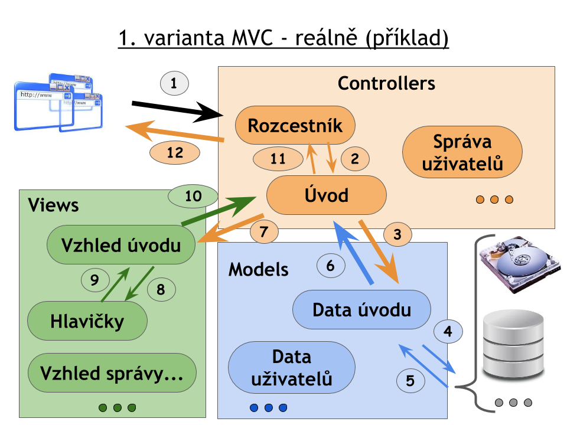

# 6. cvičení KIV/WEB - PHP a MVC.

* Projděte si prezentaci k tomuto cvičení.
* Může se hodit - [tutoriál SQL](http://www.w3schools.com/sql/default.asp).

## Hlavní cíl

* Chceme vytvořit aplikaci s MVC architekturou, která bude vypisovat pohádky a umožňovat správu uživatelů (ideálně 1. varianta MVC z prezentace, viz php-a-mvc-priklad-var1_*.png).
  * příklad zobrazení webu viz mvc_uvod.png a mvc_sprava.png.
  
  
  
* Vrstva Controllers (ovladačů) - bude obsahovat 3 soubory (con-index.php, con-uvod.class.php, con-sprava-uzivatelu.class.php).
  * "Rozcestník" - jediný vstupní bod do aplikace (con-index.php).
    * přijme požadavek na zobrazení určité stránky webu, načte odpovídající ovladač (con-uvod.class.php nebo con-sprava-uzivatelu.class.php), zavolá jeho funkci pro zpracování požadavku a výsledné HTML vypíše (tj. zobrazí ho v prohlížeči).
  * Úvod (con-uvod.class.php)
    * zavolá odpovídající model (zde patřičná funkce z mod-databaze.class.php), přijatá data předá odpovídající šabloně (tj. view-uvod.class.php) a výsledek šablony vrátí rozcestníku.
  * Správa uživatelů (con-sprava-uzivatelu.class.php)
    * zavolá odpovídající model (zde patřičná funkce z mod-databaze.class.php), přijatá data předá odpovídající šabloně (tj. view-sprava-uzivatelu.class.php) a výsledek šablony vrátí rozcestníku.
* Vrstva Models (modelů) - bude obsahovat 1 soubor pro veškerou práci s databází (mod-databaze.class.php)
  * získá požadovaná data z databáze a vrátí je volajícímu ovladači.
* Vrstva Views - bude obsahovat 3 soubory (view-hlavicky.class.php, view-uvod.class.php, view-sprava-uzivatelu.class.php)
  * přijme data, vloží je do HTML šablony a výsledný vzhled vrátí volajícímu ovladači.
* Stránky požadovaného webu
  * Úvod - na úhledné stránce zobrazuje seznam pohádek (získán z DB: orion_mvc_introductions), včetně autora a data vložení. Ukázka viz mvc-uvod.png.
  * Správa uživatelů - na úhledné stránce vypisuje všechny uživatele, přičemž jednotlivé uživatele lze mazat. Ukázka viz mvc-sprava-uzivatelu.png.
* Dále následují úkoly rozdělené dle MVC architektury. Nejlepší cestou vypracování je ale zprovoznění nejprve rozcestníku, dále úvodní stránky (kompletně) a až následně stránky se správou uživatelů.

## 0. úkol - vytvoření databáze

* V souboru mvc-database-install.sql nahraďte všechny výskyty "nyklm" za Váš orion login.
  * Získáte tak dvě tabulky, které jako prefix budou mít Váš orion login (původně: nyklm_mvc_introductions a nyklm_mvc_users).
* Importujte daný soubor do Vaší MySQL databáze (nebo do databáze na studets.kiv.zcu.cz).
* Pozn.: pokud se Vám při čtení z databáze nebude správně zobrazovat česká diakritika, tak před každým čtením z DB použijte následující dotaz:
  * $q = "SET character_set_results = 'utf8', character_set_client = 'utf8', character_set_connection = 'utf8', character_set_database = 'utf8', character_set_server = 'utf8'";        

## 1. úkol - vytvoření ovladačů

* con-index.php
  * bude jediným vstupním bodem aplikace.
  * požadovaná stránka bude předána přes GET požadavek (např. con-index.php?web=uvod).
  * zkontroluje, zda požadovaná stránka existuje (pozn.: v praxi by se ještě kontrolovalo, zda daný uživatel může danou stránku zobrazit). Měl by existovat seznam dostupných stránek.
  * zavolá ovladač odpovídající požadované stránce (con-uvod.class.php, con-sprava-uzivatelu.class.php) a vypíše jeho výstup.
  * pokud požadovaná stránka není dostupná (neexistuje), tak pouze vypíše "stránka není dostupná" (pozn.: kvůli diakritice je potřeba pouze tento výpis obalit mini HTML kódem obsahujícím určení znakové sady).

* con-uvod.class.php
  * třída zajišťující správné vykreslení úvodní stránky.
  * zavolá odpovídající metodu z mod-databaze.class.php a získá data pohádek pro stránku úvodu.
  * předá data pro stránku úvodu do šablony se vzhledem úvodu (view-uvod.class.php), která data zakomponuje do HTML kódu úvodní stránky.
  * kompletní vzhled úvodní stránky vrátí "rozcestníku", tj. do con-index.php.
  
* con-sprava-uzivatelu.class.php
  * obdobné, jako u con-uvod.class.php, pouze pro stránku se správou uživatelů.
  * navíc musí obsloužit případný požadavek na smazání uživatele (pozn.: doporučuji udělat až naposledy).
  

## 2. úkol - vytvoření modelu

* mod-databaze.class.php
  * obsahuje metodu pro získání dat úvodní stránky (DB: orion_mvc_introductions).
  * obsahuje metodu pro získání dat všech uživatelů (DB: orion_mvc_users).
  * obsahuje metodu pro smazání konkrétního uživatele (DB: orion_mvc_users).

## 3. úkol - vytvoření pohledů

* view-hlavicky.class.php
  * obsahuje metodu pro vykreslení "vršku HTML", včetně nadpisu a menu - vstupním parametrem je název stránky.
  * obsahuje metodu pro vykreslení "patičky HTML".
  * pozn.: mezi "vrškem a patičkou HTML" bude obsah stránky.
  
* view-uvod.class.php
  * obsahuje metodu, která přijatá data (pohádky) správně rozdělí do šablony, přidá "vršek a patičku HTML" a vrátí výsledný vzhled úvodní stránky.
  * každý záznam (pohádka) by na stránce měl mít svůj nadpis, autora, datum vložení a text. Záznamy lze oddělit např. vodorovnou čarou, viz mvc-uvod.png.
  
* view-sprava-uzivatelu.class.php
  * obsahuje metodu, která přijatá data (uživatele) správně rozdělí do šablony, přidá "vršek a patičku HTML" a vrátí výsledný vzhled stránky se správou uživatelů.
  * uživatelé budou vypsáni do tabulky, přičemž v posledním sloupci budou formuláře umožňující smazání konkrétního uživatele (pozn.: id uživatele lze předat input elementem typu hidden), viz mvc-sprava-uzivatelu.png.

## 4. úkol - ověření funkcionality a hezké URL adresy

* Ověřte, že Vám vše funguje, jak má.
* Prohlédněte si "ukazka.htaccess"
  * aby soubor na webu fungoval, tak musí mít název ".htaccess"
  * aby Vám fungovaly tzv. hezké URL adresy, tak musí být soubor umístěn v Root adresáři webu, tj. localhost/.htaccess nebo www.cokoliv.cz/.htaccess a ne např. students.kiv.zcu.cz/~orion/.htaccess . Na students.kiv.zcu.cz Vám tedy hezké URL adresy fungovat nebudou.
* Pokud vyvíjíte na svém PC, tak zkuste .htaccess nasadit tak, aby Vám hezké URL adresy fungovaly (možných řešení je vícero, viz popisy na internetu).
  * Pozn.: měli byste zajistit, aby Vám fungovaly jak klasické URL adresy, tak i hezké URL adresy současně. URL adresa tedy může vypadat např. localhost/con-index.php?web=uvod nebo localhost/uvod/ (popř. localhost/uvod.html), ale výsledek musí být stejný, tj. zobrazení stránky s úvodem.
  * Pozn.2: Nejspíš budete muset upravit i con-index.php - může se hodit: $url=$_SERVER['REQUEST_URI'];    

:+1:

### Poznámky

* Příklad můžete stáhnout v ZIP archivu.
* ZIP archiv s řešením vyžaduje heslo :camel:
