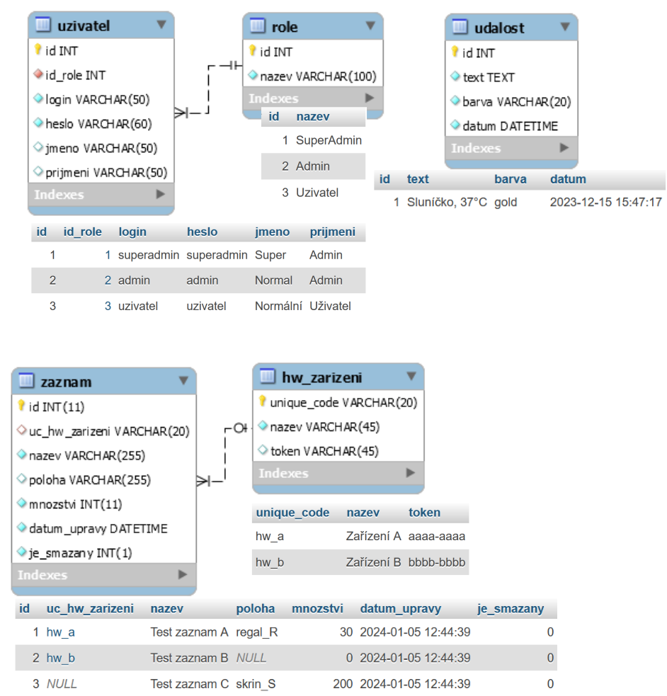

# AA. cvičení KIV/WEB - REST API a SSE API

* Projděte si prezentaci k tomuto cvičení.
* Při vypracovávání se Vám může hodit: 
  * [HTTP Request Methods](https://www.w3schools.com/tags/ref_httpmethods.asp).
  * [HTTP Status Messages](https://www.w3schools.com/tags/ref_httpmessages.asp).
  * [Handle CORS and Preflight](https://www.wpeform.io/blog/handle-cors-preflight-php-wordpress/)

## 0. úkol - Zprovoznění webové aplikace

Prohlédněte si a zprovozněte následující soubory:
* Soubor *index.php* je pouze informativní stránkou s odkazy na ostatní soubory.
* Vstupním bodem do REST API je soubor *rest_api.php*, který zpracovává všechny požadavky.
* Soubor *.htaccess* zajišťuje např. aby URL adresy od daného adresáře dále,
  které obsahují */rest_api/*, byly přesměrovány na soubor *rest_api.php*.
  * Upravte konfiguraci v souboru *.htaccess* dle vlastního filesystému a povolte část pro klasické REST API.
  * Vyzkoušejte:
    * Cesta k *rest_api.php* souboru, např.:
       <code>localhost/aktualni_priklad/rest_api.php</code>
    * Následné volání REST API, např.:
       <code>localhost/aktualni_priklad/rest_api/test_endpoint/abc/</code>
* Proveďte instalaci databáze (viz adresář *database*) a doplňte konfiguraci připojení k databázi a názvů tabulek do souboru *settings.inc.php*.
Další obsah souboru *settings.inc.php* bude popsán později.
* Prohlédněte si soubor *MyDatabase.class.php*, který obsahuje jednoduché CRUD operace nad zvolenou tabulkou.

**ERA model databáze včetně výchozích dat:**

## 1. úkol - REST API pro jeden endpoint

Cílem je v PHP vytvořit jednoduché REST API, které prostřednictvím endpointu
*zaznam* poskytne CRUD operace nad tabulkou *zaznam* v databázi serveru.

### 1.1 úkol - Parsování URL a výpis dat uživateli

* Prohlédněte si soubor *base_functions.inc.php*:
  * Funkcí pro SSE API, ani funkce *getRestAPIInfo()* si zatím všímat nemusíte. 
  * Naopak si všimněte jak je řešeno CORS (_Cross-Origin Resource Sharing_, více informací např. viz [Handle CORS](https://www.wpeform.io/blog/handle-cors-preflight-php-wordpress/)).
    * CORS defaultně zabraňuje volání REST API z libovolných URL adres.
    * Pokud je REST API používáno na stejné doméně, kde běží i klient, tak problém s CORS nenastane.
  * Prohlédněte si pomocné funkce na konci souboru. 
* Doplňte kód do funkcí pro parsování URL *getEndpointFromFriendlyURL()* a *getParametersFromFriendlyURL()*.
  * Využijte *$_SERVER["REQUEST_URI"]*, která vrací: 
  <code>napr.: tool/obecne/rest_api/endpoint/123/?a=b</code> 
  <code>nebo:  tool/obecne/rest_api/endpoint?a=b</code>
* Doplňte "hlavní funkci REST API" *sendResponse()* pro odesílání dat uživateli.
  * Nastavte HTTP hlavičky dle zvoleného typu odesílaných dat,
  vypište HTTP status odpovědi a data ve zvoleném formátu. 

### 1.2 úkol - REST API s CRUD operacemi nad tabulkou *zaznam*

* Ověřte, že v souboru *.htaccess* jsou URL adresy obsahující */rest_api/* správně přesměrovány na soubor *rest_api.php*.
* Prohlédněte si soubor *MyDatabase.class.php* s obecnými databázovými CRUD operacemi nad zvolenou tabulkou.
* Prohlédněte si soubor *rest_api.php*, tj. jak jsou získány: 
__metoda__, __endpoint__, __hodnota primárního klíče__ (PK; pokud je v URL)
a další __parametry z URL__.
* Doplňte test, zda je použitým endpointem _"zaznam"_ (konstanta *ENDPOINT_ZAZNAM*), a pokud není, 
tak na konci souboru vraťte relevantní (chybovou) odpověď s HTTP statusem _"404 Not found"_.
* Doplňte postupně testy, zda je použitou metodou GET, POST, PUT nebo DELETE. Pro případ jiné metody na konci souboru vraťte 
relevantní (chybovou) odpověď s HTTP statusem _"405 Method not allowed"_.

* __[GET] čtení záznamů:__
  * Pokud je součástí URL hodnota PK, tak získejte a vraťte uživateli JSON s odpovídajícím záznamem. (status *200 OK*) 
    Pokud nebyl záznam nalezen, tak vraťte JSON s chybovou hláškou. (status 404)
  * Pokud není PK uveden v URL, tak získejte a vraťte uživateli JSON se všemi záznamy (nebo prázdným polem) uloženými pod atributem "zaznamy",
  tj. *{ 'zaznamy': [...] }*. (status 200)
  * Příklad URL: 
  <code>localhost/rest_api/zaznam</code> 
  <code>localhost/rest_api/zaznam/123/</code>
  * Volitelně můžete povolit GET parametry URL a umožnit filtrování dle nich, 
  např.:  
  <code>localhost/rest_api/zaznam?uc_hw_zarizeni=hw_a</code>
  

* __[POST] vytvoření jednoho záznamu:__
  * Přijměte JSON odeslaný na server a pokud obsahuje nutně vyžadované informace, tak na jejich základě vytvořte v databázi nový záznam. 
  (status 201)
    * Pro přijmutí JSON využijte funkci *file_get_contents("php://input")*
  * Data odesílaná klientovi doplňte o atribut *last_insert_id* s ID vytvořeného záznamu.
  * Pokud se uložení nezdaří (např. nevalidní data), tak vraťte JSON s chybovou hláškou. (status 422)   
  * Příklad URL: <code>localhost/rest_api/zaznam</code>

  
* __[PUT] úprava jednoho záznamu:__
  * PK upravovaného záznamu je uveden v URL. 
  * Přijměte JSON odeslaný na server a jeho hodnotami aktualizujte
  příslušný záznam v databázi. (status 200)
  * Chybové hlášky:
    * Nezadání PK nebo prázdnost dat. (status 406)
    * Neexistence záznamu. (status 404)
    * Uložení se nezdařilo. (status 422)
  * Příklad URL: <code>localhost/rest_api/zaznam/123/</code>

* __[DELETE] smazání jednoho záznamu:__
  * PK mazaného záznamu je uveden v URL.
  * Smažte daný záznam z databáze. (status 200)
  * Chybové hlášky:
    * Nezadání PK. (status 406)
    * Neexistence záznamu. (status 404)
    * Smazání se nezdařilo. (status 422)
  * Příklad URL: <code>localhost/rest_api/zaznam/123/</code>
  

## 2. úkol - JS nástroj pro polo-automatizované testování REST API

Cílem je s využitím JavaScriptu vytvořit nástroj, 
se kterým bude možné manuálně volat jednotlivé funkce REST API 
a (pouze) očima ověřovat, že výstupy z REST API dávají smysl,
tj. že REST API funguje, jak má.

### 2.1 úkol - Základní funkce nástroje pro testování REST API

* Prohlédněte si soubor *testovani_rest_api.html*
  * Minimalistické HTML. 
  * Funkce pro práci se vstupy a výstupy.
  * Funkce pro manuální testování, tj. *testGET()*, *testPOST()* apod.,
  které jsou volány z GUI.
  * Zatím můžete vynechat funkci *komplexniTest()* pro "automatické komplexní textování", viz úkol 2.2. 
* Doplňte funkci *performFetch(url, currentMethod, data = null)* a funkce, které využívá:
  * Funkce používá *JS Fetch API*, volá dané URL se zvolenou HTTP metodou, 
  nastavuje funkce pro zpracování odpovědi 
  a vrací příslib (*Promise*) se zpracováním odpovědi.
  * Pokud data nejsou *null*, tak je doplní do těla požadavku.
  * Pro zpracování odpovědi:
    * Nejprve ve funkci *.then()* volejte funkci *processResponseObject()*. 
    Funkce zpracuje odpověď serveru a vrací příslib poskytnutí parsované JSON odpovědi 
    převedené na objekt.
    * V následující funkci *.then()* volejte funkci *printResponseData()*,  
    která simuluje zpracování odpovědi výpisem logu. 
    Pokud je v datech odpovědi přítomno *last_insert_id*, 
    tak jeho hodnotu uložte do proměnné *lastInsertID*.
    * Připojte i funkci *.catch()*, ve které volejte funkci *printRequestError()*.
    Funkce odchytává výjimky a simuluje jejich zpracování výpisem logu.
* Doplňte kód funkce *doOneActionInRestAPI(currentMethod, data = null)*, 
která pouze použije URL ze vstupního elementu a zavolá s ním funkci *performFetch()*. 

Nyní by na stránce *testovani_rest_api.html* měla tlačítka ___GET___, ___POST___, ___PUT___ a ___DELETE___ 
plnit svou funkci, tj. na základě hodnot zadaných do GUI volat REST API a zpracovávat jeho odpověď.
* Proveďte manuální testování vytvořeného REST API, tj. vyzkoušejte navržené CRUD operace nad endpointem *zaznam*.

### 2.2 (volitelně) Funkce pro komplexní testování CRUD operací nad jedním endpointem REST API

* Prohlédněte si základ funkce *komplexniTest()*. 
Funkce slouží pro postupné testování
správných odpovědí REST API jeho voláním
s validními i nevalidními daty. 

* Testovat budeme endpoint *zaznam*, který manuálně zadejte do GUI - 
v budoucnu lze funkci upravit tak, aby prováděla dané testy nad libovolným endpointem. 

* Všimněte si, že funkce *doOneActionInRestAPI()* (potažmo *performFetch()*)
vrací *Promise*, tj. příslib asynchronního vykonání. 
Volání této funkce s *await* vynutí čekání na dokončení asynchronní operace. 

* __[GET_ALL,VAL]__ Prohlédněte si, jak je REST API žádáno o seznam všech záznamů. 
Z poskytnutého seznamu je získána hodnota primárního klíče prvního záznamu, 
která je uložena do proměnné *testPK*, kterou následně využijeme.

Doplňte následující testy REST API:
  * __[GET,INVAL]__ Načtěte data záznamu s PK=-1, tj. URL obsahuje /-1
  * __[GET,VAL]__ Načtěte data záznamu s PK=*testPK*.
  Uložte si první vrácený záznam do proměnné a odstraňte mu PK, aby mohl být testován POST. 

  * __[POST,INVAL]__ Doplňte kopii prvního záznamu o nevalidní atribut a proveďte POST.
  * __[POST,VAL]__ V kopii prvního záznamu změňte hodnotu atributu *nazev* (PK již neobsahuje) a proveďte POST. 
  Po zpracování odpovědi serveru vypište *lastInsertID*.
  * __[POST,INVAL]__ Opakujte vložení záznamu, ale použijte v URL PK=-1.

  * __[PUT,INVAL]__ Doplňte kopii prvního záznamu o nevalidní atribut a proveďte PUT. 
  V URL použijte PK=*lastInsertID*.
  * __[PUT,VAL]__ V kopii prvního záznamu změňte hodnotu atributu *nazev* (PK již neobsahuje) a proveďte PUT.
  V URL použijte PK=*lastInsertID*.
  * __[PUT,INVAL]__ Opakujte upravení záznamu, ale použijte v URL PK=-1.

  * __[DELETE,INVAL]__ Použijte DELETE a volejte URL s PK=-1.
  * __[DELETE,VAL]__ Použijte DELETE a volejte URL s PK=*lastInsertID*.
  * __[GET,INVAL]__ Ověřte smazání záznamu pokusem o načtení dat smazaného záznamu (PK=*lastInsertID* v URL).

Nyní by na stránce *testovani_rest_api.html* mělo tlačítko ___Komplexní test___ plnit svou funkci.

## 3. úkol - Obecné REST API s CRUD operacemi

Cílem je dekomponovat CRUD operace nad zvolenou tabulkou databáze 
do obecných funkcí REST API 
a na základě konfigurace je poskytovat prostřednictvím endpointů a HTTP metod.
Současně vyvstává požadavek na překrytí některých obecných funkcí 
pro konkrétní endpoint a metodu (např. smazání záznamu), 
či na doplnění vlastního endpointu s vlastní funkcionalitou 
(např. výpis informací o REST API). 

Vytvářené obecné REST API při vývoji testujte prostřednictvím vlastního nástroje pro
polo-automatizované testování, viz 2. úkol.

### 3.1 úkol - Obecná část REST API řízená konfigurací

Protože některé funkce REST API jsou shodné pro různé endpointy
(např. čtení všech dat ze zvolené databázové tabulky), 
lze odpovídající části REST API zobecnit 
a řídit konfigurací, která bude provádět mapování *endpoint => tabulka*.
Tato konfigurace je v souboru *settings.inc.php* v konstantě *REST_API_ENDPOINTS_SETTINGS*,
přičemž každá položka obsahuje:
* Název endpointu a příslušné tabulky v databázi 
(pozn.: prefix tabulky je řešen posléze průchodem pole). 
* Název sloupce primárního klíče dané databázové tabulky (*pk_column*),
který bývá využit spolu s hodnotou primárního klíče z URL.
* Parametry pro vyhledávání (*search_params*) jsou sloupce tabulky, 
které lze v metodě GET použít pro filtrování výsledků.
* Přepínače *GET*, *POST*, *PUT* a *DELETE* povolují či zakazují
(obecné) obsluhy pro dané HTTP metody nad daným endpointem, 
např. pokud má obecná část REST API obsluhovat *DELETE* požadavek nad příslušným endpointem, 
tak v jeho konfiguraci musí být *"DELETE"=>true*. 

Využijte konfiguraci v *REST_API_ENDPOINTS_SETTINGS* a implementujte obecné REST API:
  * Vytvořte kopii souboru *rest_api.php* s názvem *obecne_rest_api.php* a úpravy provádějte v ní.
  * Upravte soubor *.htaccess* tak, aby URL obsahující */obecne_rest_api/* byly směrovány na
  soubor *obecne_rest_api.php*. Zkontrolujte i příslušné nastavení v souboru *settings.inc.php*.
  * Proveďte příslušné úpravy v souboru *obecne_rest_api.php*:
    * V podstatě stačí zobecnit REST API ze souboru *rest_api.php* tak,
      aby využívalo danou konfiguraci. 
    * Pokud je z REST API vracen seznam položek, tak bude vždy uložen pod atributem ***items***.
    * Chybové hlášky:
      * Nepodporovaný endpoint. (status 405)
      * Podporovaný endpoint, ale nepodporovaná metoda. (status 404) 

### 3.2 úkol - Vlastní funkce překrývající funkce obecného REST API

Některé funkce obecného REST API nemusejí odpovídat požadavkům pro všechny endpointy,
proto pro zadaný konkrétní endpoint a HTTP metodu chceme do obecného REST API
doplnit vlastní způsob obsloužení.

Cílem je v souboru *settings.inc.php* v nastavení *REST_API_ENDPOINTS_SETTINGS*
u endpointu ***zaznam*** přepnout *GET* a *DELETE* do stavu *false* 
a v souboru *obecne_rest_api.php* implementovat jejich vlastní obsluhu.
* Obsluhu implementujte před obsluhou pro obecné REST API.
Využijte vhodné části z konfigurace a kopie kódu z obecného REST API.
* Metoda *DELETE* nebude mazat záznam z databáze, ale pouze u něj nastaví hodnotu
*je_smazany* na *true* (tj. provede update).
* Metoda *GET* bude vracet pouze záznamy, které nejsou označeny jako smazané.
Navíc *datum_upravy* chceme formátovat jako *DateTime::ATOM* 
a chceme umožnit filtrování dle sloupců *uc_hw_zarizeni*, *nazev* a *poloha*.

Dále doplňte samostatnou obsluhu pro úpravu množství daného záznamu:
* Metoda: *PUT*.
* URL za hodnotou primárního klíče pokračuje */mnozstvi/*. Příklad URL s PK=123: 
<code>localhost/rest_api/zaznam/123/mnozstvi/</code>
* Zpracuje JSON data, která pod atributem *mnozstvi* 
obsahují hodnotu, o kterou má být množství upraveno. 
<code>{ "mnozstvi" : -55 }</code>

### 3.3 úkol - Vlastní endpoint a jeho funkce doplňující obecné REST API

Protože obecné REST API nepokrývá všechny možné případy užití,
tak ho lze doplnit o vlastní endpointy.

Cílem je doplnit do souboru *obecne_rest_api.php* obsluhu pro endpoint *info*
(viz konstanta *ENDPOINT_INFO*)
s metodou GET, která bude jako JSON poskytovat informace o možnostech daného REST API.
* Obsluhu implementujte před ostatními obsluhami v REST API.
* Informace o REST API poskytuje funkce *getRestAPIInfo()* v souboru *base_functions.inc.php*,
která je získá z konfigurace obecného REST API a z manuálně zadaných informací o doplněných endpointech,
viz konstanty *REST_API_ENDPOINTS_SETTINGS* a *REST_API_OWN_ENDPOINTS_INFO*.  
Pozor, prohlédnutím dané funkce zjistíte, že informace o doplněných endpointech vždy překryjí
informace získané z konfigurace REST API, 
což nemusí odpovídat konkrétní implementaci (záleží, jak je implementováno).
* Doplňte soubor *obecne_rest_api.php* o endpoint *info* 
s metodou GET vypisující informace o REST API.

Tímto jsme dokončili příklady týkající se REST API.

## 4. úkol - Kombinace SSE API a REST API

SSE API (*Server-Sent Events*) je další formou webového API, 
které využívá protokol HTTP a má vlastní specifikaci.
Lze říci, že SSE je mezikrokem mezi klasickou komunikací, 
při které server na jeden požadavek vrací jednu odpověď, 
a *websockets*, které udržují stálé spojení mezi klientem a serverem (HW náročné).
Při SSE klient naváže klasickou HTTP komunikaci 
a server mu následně zasílá změny dat, aniž by komunikaci ukončil 
(vyhledání a odeslání nových dat je v cyklu).
Vykonání na serveru může skončit vyčerpáním maximální doby běhu skriptu 
(v *php.ini* hodnota *max_execution_time*; defaultně 30s), 
přičemž klient by se měl postarat o opětovné připojení.

* Prohlédněte si ukázku SSE v adresáři *demo_sse* a spusťte si jí souborem *demo_sse.html*. 

### 4.1 úkol - *(část Server)* SSE odesílání dat klientovi

Základní PHP funkce pro odesílání dat klientovi využitím SSE jsou v souboru *base_functions.inc.php*:
* Prohlédněte si funkci *sseInit()*, která nastavuje HTTP hlavičky 
pro odpověď serveru při SSE komunikaci a vypisuje informaci, 
za jak dlouho po odpojení je vhodné, aby se klient znovu připojil.
Tato informace je vypsána na řádku začínajícím *retry:* a končícím *\n\n*.
Čas je vypsán v milisekundách, např. 1s: 
<code>retry: 1000 \n\n</code>
* Doplňte obsah funkce *sseSendData()* s výpisem dat klientovi:
  * Data jsou zasílána na řádku, který začíná *data:* a končí *\n\n*, např.: 
    <code>data: {'items':[]} \n\n</code> 
    PHP výpis: 
    <code>echo "data: {'items':[]} \n\n";</code>
  * Defaultně jsou data vypisována jako tzv. *message* event,
  který nemusí být uváděn. Data ale lze poslat i pod libovolným vlastním eventem, 
  pokud je vypsán bezprostředně před řádkem s daty 
  jako řádek začínající *event:* a končící *\n*, např.: 
  <code>event: vlastni_nazev_eventu \n </code> 
  <code>data: {'items':[]} \n\n </code>
  * Před odeslání dat doplňte test, zda je zvolen jiný event než "message", 
  viz *$eventType*, a pokud ano, 
  tak doplňte příslušný výpis zvoleného eventu. 

API poskytující SSE nad zvoleným endpointem je v souboru *sse_api.php*.
Soubor je v tuto chvíli kompletní, proto si prohlédněte jeho funkcionalitu.
* Povolena je pouze metoda ***GET*** a endpointy ***udalost*** a ***zaznam*** 
(resp. konstanty *ENDPOINT_UDALOST* a *ENDPOINT_ZAZNAM*), 
jinak je vrácena chybová odpověď jako u REST API.
* Následně oba endpointy využívají nekonečnou smyčku *while(true)*
pro soustavnou kontrolu změn v databázi. 
Vykonání skriptu ukončí až vypršením maximální doby běhu PHP skriptu 
(*max_execution_time* v *php.ini*, a v PHP nastavení funkcí 
*set_time_limit()*, pokud na to máme oprávnění). 
* Endpoint *udalost* poskytne poslední záznam z databázové tabulky *udalost*
a následně soustavně kontroluje, zda v tabulce nepřibyl nový záznam. 
A pokud záznam přibyl, tak ho odešle klientovi.
* Endpoint *zaznam* poskytuje záznamy, které byly upraveny:
  * Odešle aktuální DateTime 
  jako data vlastního SSE eventu *server_time*.
  * Zkontroluje, jestli v GET parametrech URL adresy není přítomen
  parametr *last_check* s datem, od kterého chceme záznamy vyhledávat.
  Pokud není, tak bude použita defaultní hodnota (zvoleno 2022-01-01 00:00).
  * Soustavně z databáze získává záznamy, které mají *datum_upravy >= last_check*,
  a provádí následující:
    * Formátuje u záznamů datum úpravy do zvoleného tvaru.
    * Ukládá záznamy do objektu dat pod atribut *items*.
    * Přidává do objektu dat atribut *datetime* s hodnotou DateTime před čtením z databáze.
    * Odesílá objekt s daty klientovi.

### 4.2 úkol - *(část Klient)* Automatická aktualizace poslední události a seznamu záznamů na zobrazené stránce

Klientská část aplikace v souboru *testovani_sse_api.html* 
v tomto případě nevyužívá PHP 
pro výpis dat uživateli, ale jedná se o HTML stránku,
která svá data získává a aktualizuje prostřednictvím JavaScriptu. 
Ten pro komunikaci s REST API využívá JS *Fetch API* 
a pro komunikaci se SSE API využívá JS třídu *EventSource*, 
která slouží právě k tomuto účelu. 

Stránka má dvě části:
* Část **Poslední událost** zobrazuje a aktualizuje
poslední událost získanou ze serveru využitím SSE API.
Formulář pro vložení nové události využívá REST API.
* Část **Záznamy** zobrazuje aktualizovaný seznam záznamů
a umožňuje úpravu jejich množství:
  * Záznamy jsou nejprve načteny využitím REST API,
  přičemž je z nich extrahován nejnovější *datum_upravy* 
  a uložen do *lastCheckTime*.
  * Pro aktualizaci záznamů je využito SSE API, přičemž
  nejprve jsou žádány pouze záznamy s datem úpravy 
  větším či rovným *lastCheckTime* z předchozího kroku.
  Data se záznamy získaná ze SSE API ale navíc obsahují atribut
  *datetime* s hodnotou DateTime před čtením z databáze,
  kterým je *lastCheckTime* průběžně aktualizován. 
  Využit bude při opětovném navazování spojení se SSE API po jeho výpadku. 
  * Všimněte si, že REST API neposkytuje záznamy označené jako
  smazané, ale SSE API tyto záznamy poskytuje, aby je mohl 
  klient odstranit ze svého GUI 
  (to ale nyní implementovat nebudeme).
  * Změna množství u záznamu odesílá požadovanou úpravu na server 
  využitím REST API, ale neaktualizuje GUI. 
  To je aktualizováno automaticky využitím SSE API 
  (tj. GUI se upraví, až server pošle záznamy změněné v databázi).

Prohlédněte si soubor *testovani_sse_api.html*
a dokončete jeho funkcionalitu.
* Prohlédněte si HTML, které v souboru je:
  * Uprostřed kódu je oblast pro skripty. 
  * Nad skripty je hlavní část GUI. 
  * Pod skripty je HTML šablona pro výpis jednoho záznamu.
  * Zcela dole je stručná nápověda ke stránce.
  * Skripty jsou rozděleny do 5 elementů *&lt;script&gt;*,
    které (pouze vizuálně) oddělují jejich funkce.
* Prohlédněte si následující skripty, které jsou kompletní:
  * Skript **Základní konfigurace**:
    * Obsahuje základní konfiguraci.
    * Po načtení stránky spouští JS aplikaci,
    tj. získání a vykreslení seznamu záznamů z REST API 
    a inicializaci naslouchání SSE API pro
    aktualizaci poslední události a vykreslených záznamů.
  * Skript **Úpravy GUI**:
    * Funkce *actualizeZaznamyHTMLElements(itemsList)* a *actualizeZaznamHTMLElement(zaznamData)* 
    na základě seznamu záznamů aktualizují jejich seznam zobrazený v GUI.
    Při vytváření záznamů v GUI je kopírována HTML šablona záznamu.
    * Funkce *processFormMnozstviOnSubmit(form, event)*
    zajišťuje zpracování formuláře u zobrazeného záznamu
    a odeslání příslušného požadavku na změnu množství do REST API.
    * Funkce *setZaznamyConnectionIndicator(text, bgColor)*
    slouží pro indikaci stavu komunikace se SSE pro aktualizaci záznamů. 
  * Skript **Práce s REST API**:
    * Funkce *getAllItemsFromRestApi()* obsahuje inicializaci komunikace s REST API
    a zpracování získaného seznamu záznamů. 
    Metoda ***GET***, endpoint ***zaznam***.
    * Funkce *sendIntoRestAPI(url, method, requestData)* inicilizuje komunikaci s REST API
    na dané URL adrese a odesílá data zvolenou metodou.  
    Metoda ***POST*** nebo ***PUT***.
    * Funkce *postUdalost()* získá z formuláře v GUI text a barvu nové události
    a odešle je do REST API, které událost uloží do databáze s aktuálním DateTime. 
    Metoda ***POST***, endpoint ***udalost***.
    * Funkce *putItemMnozstviChange(pkValue, mnozstvi)* odešle do REST API
    požadavek na úpravu množství konkrétního záznamu o zadanou hodnotu. 
    Metoda ***PUT***, endpoint ***zaznam*** s PK konkrétního záznamu.
  * Ověřte funkčnost volání REST API v GUI v části *Záznamy*.
    * Doplňte správné URL adresy do proměnných *$url* 
    ve skriptu *settings.inc.php* s konfigurací.
    * Na stránce tlačítkem *Aktualizace z REST API* získejte vizualizované záznamy.
    Zvolte několikrát libovolné tlačítko pro změnu množství 
    a znovu záznamy aktualizujte, aby se změny zobrazily.
  

* Dokončete skripty pro inicializaci SSE komunikace.
  * Skript **SSE API Poslední událost**:  
    * Dokončete funkci *initEventSourceForSSEListeningForUdalost()*,
    která využije JS třídu *EventSource* a inicializuje naslouchání
    SSE API pro získávání události a její aktualizaci v GUI.
    * Zahájení spojení a chybu komunikace pouze vypište do konzole 
    (události *source.onopen* a *source.onerror*).
    * V události *source.onmessage* zpracujte JSON s daty získanými ze SSE API
    (uložena v *event.data*). Pokud ID přijaté události není shodné
    s ID události vykreslené v GUI, tak událost v GUI aktualizujte. 
    <code>source.onmessage = function (event) {...}</code>
    * Ověřte v GUI, že kompletně funguje část s poslední událostí.
    * Podívejte se do konzole v prohlížeči, kde je vidět, 
    že po chybě SSE spojení (vypsaný error) je opětovné připojení navázáno až po čase,
    který server zaslal při inicializaci SSE na řádku začínajícím *retry*, 
    např. "retry: 5000 \n\n", tj. 5s.
  * Skript **SSE API Aktualizace záznamů**:
    * Dokončete funkci *initEventSourceForSSEListeningForZaznamy()*,
    která využitím JS *EventSource* zajišťuje aktualizaci záznamů v GUI.
    * V tomto případě nebude EventSource zajišťovat opětovné připojení k serveru,
    ale při chybě komunikace provedeme připojení samostatně
    s novou URL adresou (obsahující aktualizovaný GET parametr *last_check*).
    Bohužel tím ztrácíme možnost využít "retry", 
    které je zasílané ze serveru při inicializaci SSE 
    (v současnosti není možnost, jak jeho hodnotu z EventSource číst;
    můžeme ale hodnotu pro "retry" poslat jako data vlastního SSE eventu).
    * Prohlédněte si funkci *source.addEventListener*, která ukazuje,
    jak je reagováno na data zaslaná v SSE eventu *server_time*.
    Výstupem je pouze vypsání získaného času 
    do elementu indikátoru v GUI (barva jeho pozadí není měněna).
    * Doplňte reakce na události *source.onopen* a *source.onerror*,
    které nyní pouze upraví barvu indikátoru v GUI 
    (např. open "#91ff81", error "#ff9898"; text bude null).
    * V události *source.onmessage* zpracujte data přijatá ze SSE API.
    Pokud obsahují atribut *items*, 
    tak aktualizujte záznamy v GUI (funkce *actualizeZaznamy..*).
    Pokud obsahují atribut *datetime*, 
    tak jeho hodnotu uložte do proměnné *lastCheckTime* 
    (proměnná, kterou přidáváme do URL).
    * Do *source.onerror* doplňte vlastní obsluhu opětovného připojení k serveru.
    Ta nejprve ukončení aktuální spojení *source.close()* a následně
    inicializuje nový Timeout do proměnné *myReconnectTimeout*,
    který opět zavolá funkci pro inicializaci SSE po zadaném čase 
    (konstanta *reconnectTime*).
    * Abychom zajistili vypnutí naslouchání i při vlastním požadavku 
    (např. stisk tlačítka v GUI), tak doplňte kód funkce *stopEventSourceForSSEListeningForZaznamy()*,
    která ukončí příslušný EventSource (funkce *source.close()*) a 
    příslušný Timeout (funkce *clearTimeout(timeout)*). 
    * Ověřte v GUI, že kompletně funguje část se seznamem záznamů.
    Pokud u záznamů změníte tlačítky množství, 
    tak po krátkém čase by měl být výpis záznamů aktualizován,
    tj. až SSE API pošle upravené záznamy (zpět) klientovy.
  * Ověřte kompletní funkce stránky tím, že ji současně otevřete 
  více oknech prohlížeče - úpravy v jednom okně se budou díky SSE
  automaticky promítat do ostatních oken.

## Úkoly na doma

Dle vlastní iniciativy můžete:
* Zkusit vytvořit REST klienta v PHP či v Python.
* Zkusit vytvořit SSE klienta v jiném programovacím jazyce (např. Android).

## Výstupy cvičení

* Student by měl vědět, jakým způsobem REST API pro komunikaci s klientem 
využívá HTTP metody a HTTP statusy.
* Student by měl umět vytvořit vlastní REST API s CRUD operacemi nad databázovou tabulkou.
* Student by měl vědět, jak funguje klient v JavaScriptu, který využívá REST API, 
a měl by být schopen ho implementovat.
* Student by měl vědět, jaké principy využívá SSE (*Server-Sent Events*) komunikace.
* Student by měl umět vytvořit vlastní SSE API.
* Student by měl vědět, jak funguje klient v JavaScriptu, který využívá SSE API,
a měl by být schopen ho implementovat.
* Student by měl vědět, jak se vzájemně doplňují REST API a SSE API
a jak využít jejich kombinaci.

### Poznámky

* Příklad můžete stáhnout v ZIP archivu.
* Závěrem zvířátko :hatching_chick:

-----
----

# TODO - Pracovní poznámky

?? - klient v PHP ???? (asi by to chtělo)

-----------------------------------------

Představa pro videa:

1) Projití poskytnutých souborů zadání a REST API pro jednu tabulku.
2) Testování jednoho enpointu REST API prostrednictvim vlastniho JS.
3) Obecné REST API.
4) Testování obecného REST API.(??)
5) SSE API pro jednu tabulku.
6) Ukázková stránka s "kompletním" využitím SSE API pro čtení změn a REST API pro provádění změn (změny jen asi názvu).

-----------------------------
????

REST API
- Využívá HTTP metody požadavků a HTTP statusy odpovědí.
- URL adresa obsahuje název endpointu a popř. hodnotu primárním klíče zpracovávaného záznamu. Například:
  - URL základ: <code>http://www.domena.cz/adresarA/rest_api/ </code>
  - Endpointy: <code>zařízení, uzivatel</code>
- Při čtení všech záznamů GET metodou lze obvykle využít GET parametry v URL pro filtrování záznamů. Například:
  - <code>?is_active=true&has_gps_sensor=true</code>

- URL adresy pro endpoint ZARIZENI:
  - [GET] <code>/rest_api/zarizeni/</code> - čtení všech záznamů.  
  - [GET] <code>/rest_api/zarizeni/33/</code> - čtení jen záznamu s PK=33.  
  - [POST] <code>/rest_api/zarizeni/</code> - vytvoření záznamu.
  - [PUT] <code>/rest_api/zarizeni/33/</code> - úprava záznamu s PK=33.
  - [DELETE] <code>/rest_api/zarizeni/33/</code> -  smazání záznamu s PK=33.
